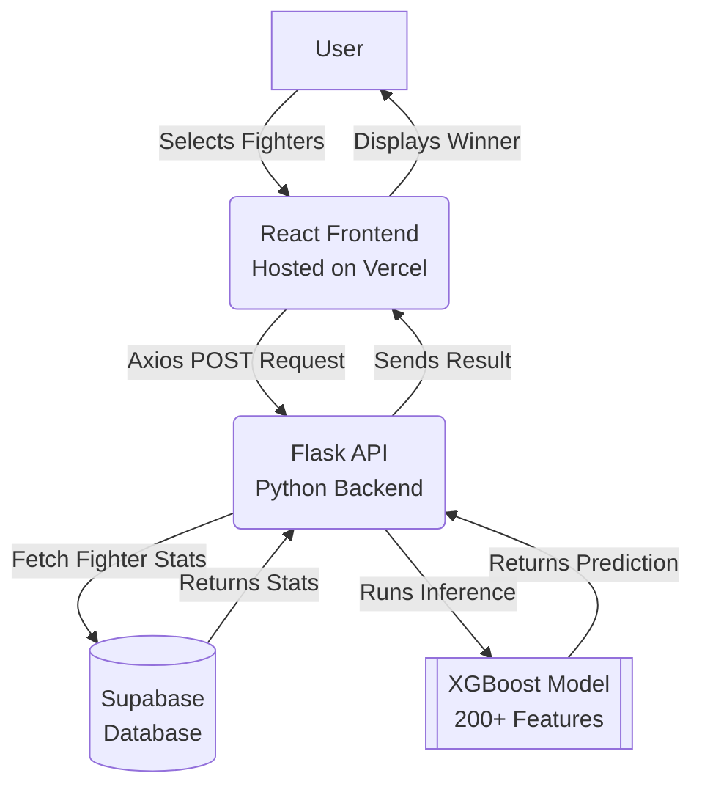

# UFC Fight Predictor

## What Is This?
I built a Machine Learning-powered web application that predicts the outcomes of UFC fights. You can select any two active fighters on the roster, and the model will analyze their statistics to predict the winner. My primary focus for this project was on the data and machine learning pipeline, where I achieved solid accuracy. In backtesting against historical betting odds, the model demonstrated a 13.8% return on investment, which I'm pretty proud of.

## Features
- **Matchmaking Interface:** Match up any two fighters against each other on the live site.
- **Predictive Model:** Powered by an XGBoost algorithm trained on a large dataset of historical UFC bouts.
- **Deep Feature Engineering:** Rather than just looking at basic win/loss records, the model utilizes over 200 different features, including striking differentials, grappling statistics, physical attributes, and recent fight form.
- **End-to-End Pipeline:** A complete system built from scratch, from the raw data processing scripts to the deployed live website.

## System Architecture

Here is a high-level schematic of how the different pieces of the project communicate:

## How I Built It
The project is split into two main components: the Machine Learning pipeline and the Web Application.

### Data & Machine Learning (Python, XGBoost)
This is the core of the project. I processed a massive dataset of historical UFC fights and spent a significant amount of time on feature engineering. I created over 200 features, such as rolling averages for strikes landed and takedown defense percentages. I chose Python and XGBoost because it handles this kind of complex tabular data exceptionally well compared to other models I tested.

### Backend (Python, Flask, Supabase)
To serve the model on the web, I built a REST API using Python and Flask. The API takes the user's selected fighters, runs them through the trained model, and returns the prediction. I also integrated Supabase to store all the static fighter data, making the frontend fetching process fast and reliable.

### Frontend (React.js, Axios)
Since my background is primarily in ML, I learned React specifically for this project to build the user interface. It is a straightforward React application that uses Axios to send requests to my Flask backend and display the results cleanly on the screen. It gets the job done perfectly and was a great learning experience.

## Deployment
I deployed the React frontend on Vercel, which made hosting the site very straightforward.
- **Live Link:** [UFC Predictor Live](https://ufc-predictor-nzle.vercel.app/#top)

## What Makes It Special
Most fight predictors available online are fairly basic and tend to just guess based on who has the better record or who is the betting favorite. I spent a lot of time on feature engineering to ensure the model actually understands the mechanics of a fight—for example, how a heavy striker matches up against a grappler. Because of this depth, the model actually identifies inefficiencies in matchups and yields a 13.8% return instead of blindly guessing. Furthermore, connecting a complex ML model to a fully functioning web app made this a highly rewarding full-stack project.
